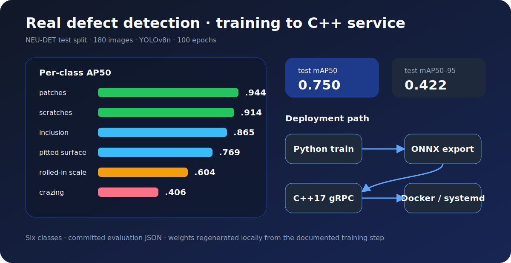
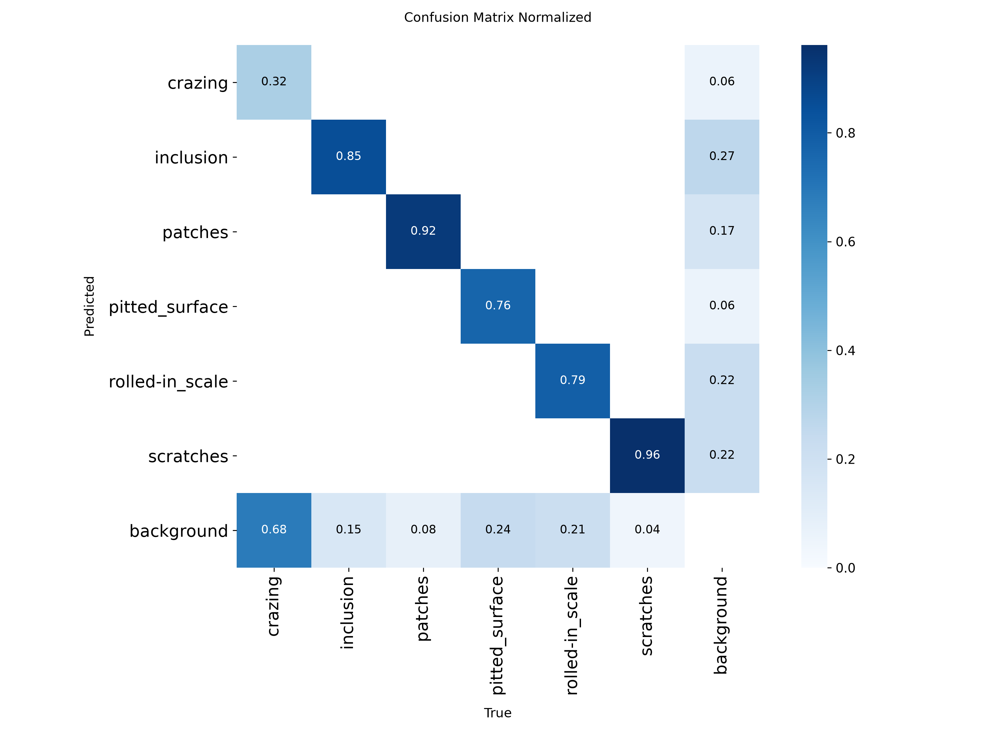
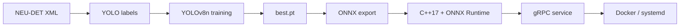

<div align="center">

# VisionGuard

**Industrial surface-defect detection from training to a C++ inference service**

*YOLOv8 · ONNX Runtime · C++17 gRPC · NEU-DET*


<a href="https://github.com/MeaFew/visionguard/actions"></a>


<a href="./README.md">中文</a> | **English**

</div>

---

## Headline

> **YOLOv8n reaches test mAP50 = 0.750 and mAP50–95 = 0.422 on the real NEU-DET dataset.** The delivery path continues beyond Python: trained weights are exported to ONNX and served by a C++17 gRPC application with Docker and systemd deployment.

<p align="center">
  
</p>

| Class | AP50 |
|-------|-----:|
| patches | **0.944** |
| scratches | **0.914** |
| inclusion | 0.865 |
| pitted_surface | 0.769 |
| rolled-in_scale | 0.604 |
| crazing | 0.406 |

> Protocol: 1,800 NEU-DET images; train/validation/test = 1,440/180/180; 100 epochs. Full metrics: [`assets/real_evaluation_test.json`](assets/real_evaluation_test.json).

<p align="center">
  
</p>

<p align="center">
  
</p>

## Architecture



## Quick start

```bash
git clone https://github.com/MeaFew/visionguard.git
cd visionguard

python -m venv .venv
# Linux / macOS: source .venv/bin/activate
# Windows PowerShell: .venv\Scripts\Activate.ps1

make install-dev
make data

# Produces the default model path used by evaluation/export/deployment
python scripts/train_yolo.py --epochs 100 --batch 8 --device 0 \
  --project runs/detect/models --name real_train

python scripts/evaluate.py --split test
python scripts/export_onnx.py
python scripts/demo_inference.py --output reports/demo_detection.jpg
```

The repository commits evaluation JSON and showcase images, but not `.pt` or `.onnx` weights. Evaluation, export, and deployment therefore require the training step above to create `runs/detect/models/real_train/weights/best.pt`; a clean clone cannot silently reuse a local model.

## C++ inference service

```bash
cd cpp && mkdir build && cd build
cmake .. \
  -DCMAKE_PREFIX_PATH="/opt/onnxruntime/lib/cmake/onnxruntime" \
  -DONNXRuntime_DIR="/opt/onnxruntime/lib/cmake/onnxruntime"
make -j$(nproc)
./visionguard_server \
  --model ../../runs/detect/models/real_train/weights/best.onnx
```

Docker Compose mounts the same ONNX model read-only into the service container:

```bash
python scripts/export_onnx.py --model runs/detect/models/real_train/weights/best.pt
docker compose up --build
```

## Quality gates

```bash
pytest tests/ -v
ruff check .
ruff format --check .
```

## Project structure

```text
visionguard/
├── visionguard/      # Python package
├── scripts/          # data, training, evaluation, export, demo
├── configs/          # YOLOv8 dataset/training configuration
├── cpp/              # C++ ONNX Runtime + gRPC service
├── deployment/       # Docker, systemd, and operations scripts
├── assets/           # committed evidence and README visuals
├── reports/          # evaluation and benchmark reports
└── tests/            # Python tests
```

<details>
<summary><b>Synthetic-data smoke test</b></summary>

When NEU-DET cannot be downloaded, `scripts/generate_synthetic_data.py` can validate the pipeline. Synthetic data is for execution checks only and does **not** support real-world performance claims.

</details>

## License

MIT
