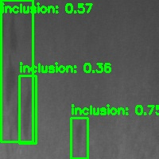
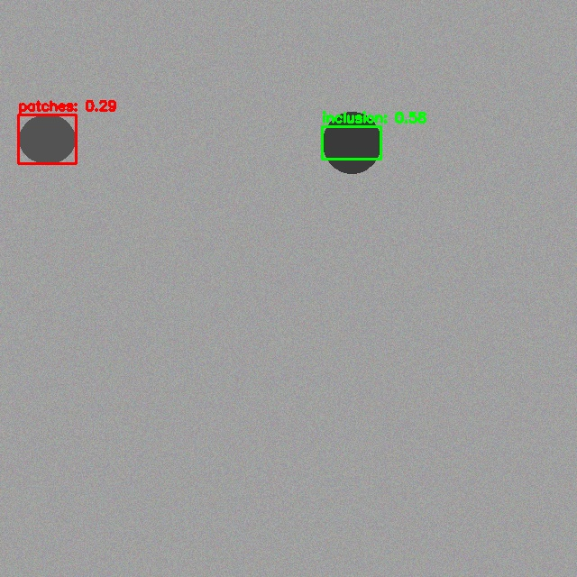

# VisionGuard

工业表面缺陷智能检测系统（Industrial Surface Defect Detection System）。

基于 **YOLOv8** 进行钢材表面缺陷目标检测，使用 **OpenCV** 实现传统图像预处理，并通过 **ONNX Runtime + C++17** 构建高性能推理服务，最终交付 **Docker / systemd / shell 脚本** 化的 Linux 部署方案。

## 项目时间线

本项目于 **2025 年 8 月** 启动，在 **2025 年 8 月至 10 月** 之间迭代完善并完成。

| 阶段 | 时间 | 说明 |
|---|---|---|
| 项目初始化 | 2025-08-01 ~ 2025-08-05 | 目录结构、依赖、Makefile、文档 |
| 数据集与预处理 | 2025-08-06 ~ 2025-08-15 | NEU-DET 下载、转换、OpenCV 预处理 |
| 模型训练 | 2025-08-16 ~ 2025-08-31 | YOLOv8 训练、评估、ONNX 导出 |
| C++ 推理服务 | 2025-09-01 ~ 2025-09-20 | ONNX Runtime 推理 + gRPC |
| 部署与运维 | 2025-09-21 ~ 2025-09-30 | Docker、systemd、CI |
| 测试与文档 | 2025-10-01 ~ 2025-10-15 | pytest、集成测试、benchmark |
| 收尾优化 | 2025-10-16 ~ 2025-10-31 | 性能调优、文档完善 |

## 快速开始

```bash
# 1. 安装依赖
make install-dev

# 2. 下载并准备 NEU-DET 数据集
make data

# 3. 训练 YOLOv8
python scripts/train_yolo.py --epochs 100 --batch 8 --device 0

# 4. 评估模型（默认使用真实 NEU-DET 训练结果）
python scripts/evaluate.py --split test

# 5. 导出 ONNX
python scripts/export_onnx.py

# 6. Python 端到端推理 demo
python scripts/demo_inference.py --output reports/demo_detection.jpg

# 7. 编译并运行 C++ 推理服务
cd cpp && mkdir build && cd build
cmake .. -DCMAKE_PREFIX_PATH="/opt/onnxruntime/lib/cmake/onnxruntime" -DONNXRuntime_DIR="/opt/onnxruntime/lib/cmake/onnxruntime"
make -j$(nproc)
./visionguard_server --model ../../runs/detect/train/weights/best.onnx
```

## 真实 NEU-DET 结果

使用 **YOLOv8n** 在真实 NEU-DET 数据集（1800 张，train/val/test = 1440/180/180）上训练 **100 epoch**，GPU 为 RTX 4060 Laptop（batch=8），测试集指标：

| 指标 | 数值 |
|---|---|
| val mAP50 | **0.783** |
| test mAP50 | **0.750** |
| test mAP50-95 | **0.422** |

各类别 test AP50：

| 类别 | AP50 |
|---|---|
| patches | 0.944 |
| scratches | 0.914 |
| inclusion | 0.865 |
| pitted_surface | 0.769 |
| rolled-in_scale | 0.604 |
| crazing | 0.406 |

ONNX 推理可视化示例（真实测试图 `inclusion_14.jpg`）：



完整指标见 [`assets/real_evaluation_test.json`](assets/real_evaluation_test.json)。

## 合成数据 Demo

如果无法下载真实 NEU-DET，可使用 `scripts/generate_synthetic_data.py` 生成合成数据验证 pipeline。合成数据仅用于验证 pipeline 正确性，不代表真实场景性能。

使用 YOLOv8n 在 100 张合成样本上训练 50 epoch（CPU），测试集指标：

```json
{
  "map50": 0.679,
  "map75": 0.542,
  "map": 0.487
}
```



## 测试

```bash
# Python 测试
pytest tests/ -v

# 代码格式检查
ruff check .
ruff format --check .
```

## 部署

### Docker Compose（仅推理服务）

先导出 ONNX 模型，再启动 gRPC 服务：

```bash
python scripts/export_onnx.py --model runs/detect/train/weights/best.pt
docker compose up --build
```

### Linux 原生部署

```bash
sudo bash deployment/scripts/deploy.sh
sudo bash deployment/scripts/health_check.sh
```

## 技术栈

- Python 3.11 + Ultralytics YOLOv8 + PyTorch
- OpenCV 4.x（传统图像处理）
- C++17 + ONNX Runtime 1.18+（高性能推理）
- gRPC + Protobuf（服务通信）
- Docker + Docker Compose（容器化部署）
- systemd + bash（Linux 运维）
- pytest + Catch2（测试）
- GitHub Actions（CI/CD）

## 目录结构

```text
visionguard/
├── configs/        # YOLOv8 训练配置
├── cpp/            # C++ 推理服务
├── data/           # 数据集
├── deployment/     # Docker / systemd / 运维脚本
├── docs/           # 文档
├── notebooks/      # Jupyter 数据探索
├── reports/        # 评估与 benchmark 报告
├── scripts/        # 可执行脚本
├── tests/          # Python 测试
└── visionguard/    # Python 包
```

## 许可证

MIT
